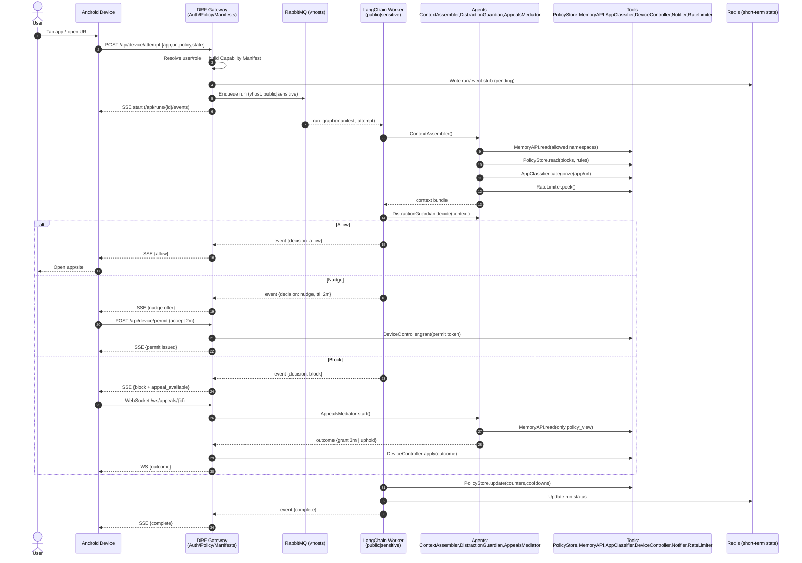

Here are two concise UML-style diagrams in Mermaid that Cursor should render fine: a **sequence diagram** for the app/site attempt + appeals, and a **flow/activity diagram** for the Distraction Guardian’s decision logic (strictness, nudge vs block).



```mermaid
flowchart TD
    A[Start: Attempt arrives<br/>app/url + current policy] --> B[Assemble Context<br/>blocks, goals policy_view,<br/>strictness, history, category]
    B --> C{Category allowed<br/>by current block?}
    C -- Yes --> ALLOW[ALLOW<br/>Return allow decision]
    C -- No --> D{Strictness threshold<br/>reached?}
    D -- Low/Moderate --> NUDGE[NUDGE<br/>Offer micro-permit (e.g., 2m)]
    D -- High --> E{Recent compliance good?<br/>(few overrides, obeyed nudges)}
    E -- Yes --> NUDGE
    E -- No --> F{Appeal allowed?<br/>(timebox, cooldown)}
    F -- No --> BLOCK[BLOCK<br/>Short, firm message]
    F -- Yes --> APPEAL[APPEAL<br/>Open WS chat]
    APPEAL --> G{User rationale acceptable?<br/>(goal-aligned, brief, rare)}
    G -- Yes --> PERMIT[Grant temporary permit<br/>(2–5m), log]
    G -- No --> BLOCK
    NUDGE --> PERMIT?{User accepts nudge?}
    PERMIT? -- Yes --> PERMIT
    PERMIT? -- No --> BLOCK
    ALLOW --> H[Update counters/cooldowns<br/>smooth strictness adjust]
    PERMIT --> H
    BLOCK --> H
    H --> I[Emit audit + events]
    I --> J[End]
```

If you want a quick **component diagram** too (how services fit together):

```mermaid
graph LR
  subgraph Client
    React[React Web App]
    Android[Android App]
  end

  subgraph Server
    DRF[DRF Gateway<br/>Auth, RBAC, Manifests, SSE/WS]
    Redis[(Redis<br/>short-term state)]
    RMQ[(RabbitMQ<br/>vhosts: public, sensitive)]
  end

  subgraph Workers
    PublicW[LangChain Worker - Public]
    SensitiveW[LangChain Worker - Sensitive]
  end

  subgraph LC[LangChain Graph]
    Context[Context Assembler]
    Guardian[Distraction Guardian]
    Mediator[Appeals Mediator]
    Planner[Schedule Planner]
  end

  subgraph Tools
    PolicyStore[PolicyStore]
    MemoryAPI[Memory API<br/>namespaced]
    AppClass[AppClassifier]
    DeviceCtl[DeviceController]
    Notifier[Notifier (FCM/VAPID)]
    RateLimiter[RateLimiter]
  end

  React -- SSE/WS --> DRF
  Android -- SSE/WS + FCM --> DRF
  Android -- Device intents --> DRF
  DRF <---> Redis
  DRF -- enqueue --> RMQ
  RMQ -- public --> PublicW
  RMQ -- sensitive --> SensitiveW
  PublicW --> LC
  SensitiveW --> LC
  LC --> Tools
  Tools --> Redis
```

These mirror the behavior we discussed: DRF builds a capability manifest, routes to the correct worker via RabbitMQ vhosts, Distraction Guardian makes a fast decision (allow/nudge/block/appeal), and—if needed—Appeals Mediator runs a short WebSocket dialogue before granting a temporary permit or upholding the block.
