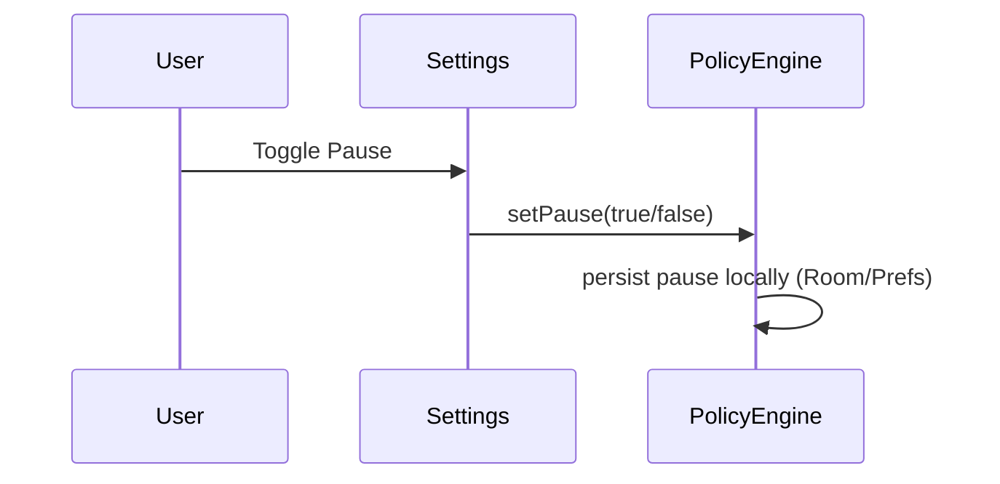
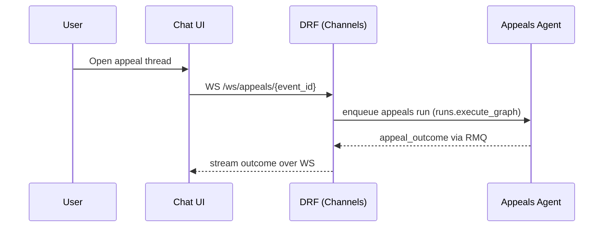
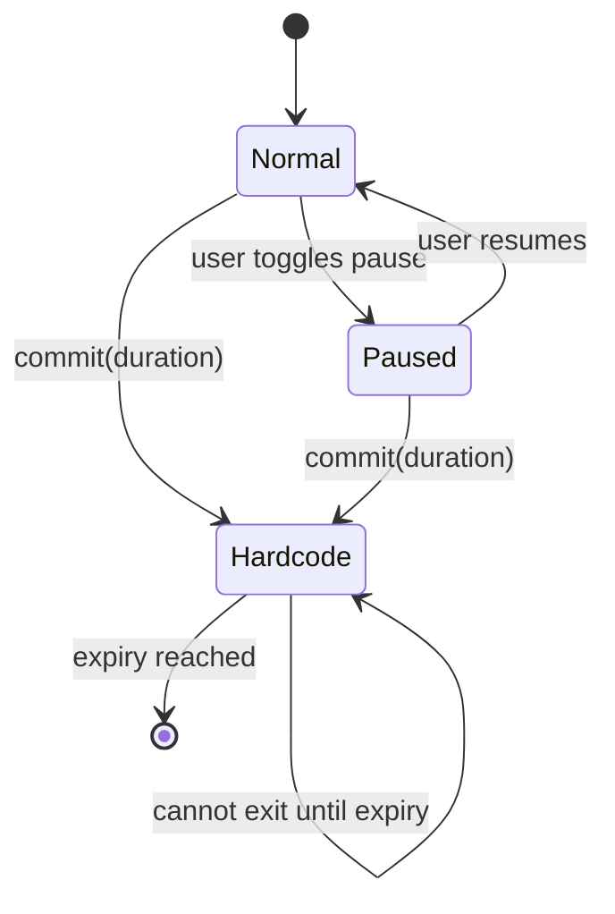
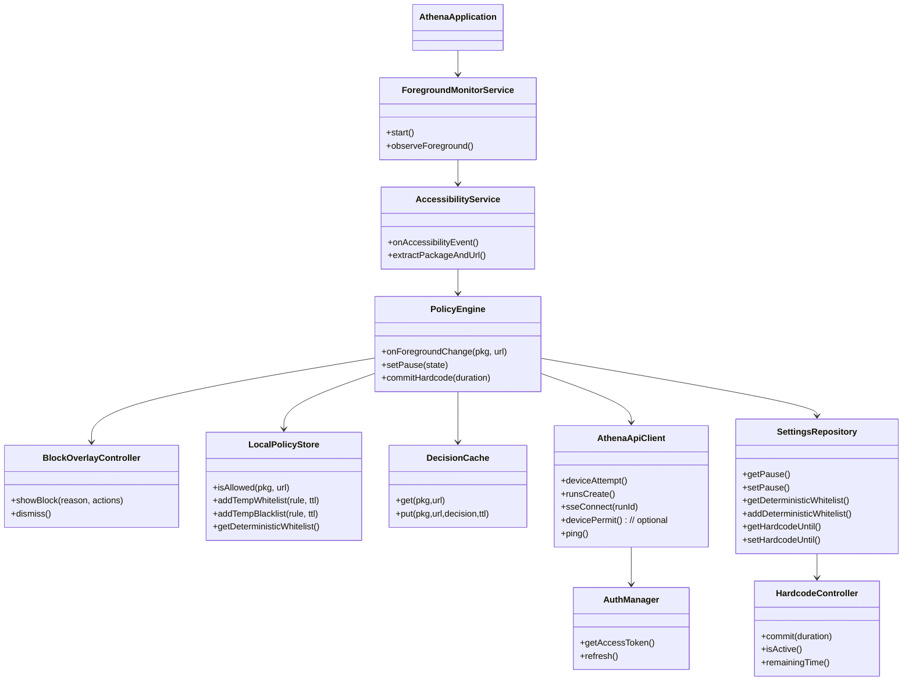

# Athena Android Rebuild Proposal

This document proposes a fresh architecture for the Athena Android app with:
- A ChatGPT-like primary interface for talking to Athena’s front-facing agents
- System-wide activity tracking for apps and websites
- Real-time allow/block decisions from the Guardian agent via DRF
- Local policy cache (temporary blacklist/whitelist with TTL, deterministic whitelist in settings)
- Override, pause, and “hardcode mode” controls
- Robust, class-based DRF integrations that work online and offline
- The app is to be called Athena, the app id/namespace is com.ironmeerkat.athena, the directory within the monorepo is to be called athena-android.

---

## Product Goals
- Seamless chat-first experience; the app opens directly to chat with Athena.
- Non-intrusive background monitoring of app and web usage.
- Instant decisioning: local rules first, server decision within ~200ms typical, graceful offline behavior.
- Clear, unskippable block screen with appeal flow; deterministic short-term override (5 minutes).
- Deterministic whitelist in settings; pause capability; and hardcode mode that locks down controls and uninstall.
- Privacy-first: minimize data collected, encrypt in transit and at rest, transparent logs.

---

## Top-Level Architecture

- UI Layer (Jetpack Compose)
  - Chat Screen (default/home)
  - Block Screen Overlay (always-on-top when triggered)
  - Settings → Policy, Whitelists, Pause, Hardcode Mode
- Services & System Integration
  - AccessibilityService for foreground app/URL detection
  - Foreground Service for reliable lifecycle and event pipeline
  - (Optional) Local VPN for network-level domain inference (if needed for difficult browsers)
  - Device Policy Manager integration for hardcode mode (device/profile owner) and uninstall blocking
- Policy & Decisioning
  - PolicyEngine orchestrates local cache, server decisions, and UI actions
  - Local Policy Store (Room): temporary rules with TTL + deterministic whitelist
  - Decision Cache: recent decisions, debounced by domain/app and time
- Networking
  - DRF HTTP: POST /api/device/attempt, POST /api/device/permit (optional), POST /api/runs
  - Streaming: GET /api/runs/{run_id}/events (SSE) for decisions/events
  - SSE events include: run_started, decision, appeal_outcome, run_error, run_completed (topic: runs.{run_id})
  - WebSocket: /ws/appeals/{event_id} for appeal chat
  - No DRF notifications required for Pause/Resume or Hardcode commit (device‑local)
- Security & Telemetry
  - Auth: JWT (SimpleJWT) and optional Firebase ID tokens (if configured) via Authorization: Bearer; device attestation when available
  - Structured logs, rate-limited upload to DRF

---

## Key User Flows (UML)

### App/URL Decision Flow (activity → decision → block/allow)
```mermaid
sequenceDiagram
    participant User
    participant OS as Android OS
    participant Acc as AccessibilityService
    participant PE as PolicyEngine
    participant LPS as LocalPolicyStore
    participant DRF as DRF (Runs + Device)
    participant Overlay as Block Overlay

    OS->>Acc: Foreground change (package, title, [url?])
    Acc->>PE: onForegroundChange(package, url)
    PE->>LPS: queryLocalRules(package, url)
    alt Allowed by local policy or pause active
        LPS-->>PE: allow
        PE-->>Acc: no action (allow)
    else Not locally allowed
        LPS-->>PE: no match
        PE->>DRF: POST /api/device/attempt {device_id, app, url, ts}
        DRF-->>PE: {run_id, decision: "pending", sse: "/api/runs/{run_id}/events"}
        PE->>DRF: GET /api/runs/{run_id}/events (SSE)
        DRF-->>PE: event "decision" {allow|block, message, permit_ttl, appeal_available}
        alt allow
            PE-->>Acc: allow
        else block
            PE->>Overlay: showBlock(reason, actions=[Appeal, Override5m])
            User->>Overlay: clicks [Appeal] or [Override]
            alt Override 5 min
                Overlay->>PE: overrideTTL(5m)
                PE->>LPS: addTempWhitelist(package/url, ttl=5m)
                Note over PE,DRF: Optional: POST /api/device/permit {event_id, ttl_minutes}
                Overlay-->>User: dismiss, allow for 5m
            else Appeal
                Overlay->>PE: startAppeal(run_id)
                PE->>DRF: WS /ws/appeals/{run_id}
                Note over User,DRF: Open chat; block remains until outcome event
            end
        end
    end
```

### Hardcode Mode Commit (device‑local)
```mermaid
sequenceDiagram
    participant User
    participant Settings
    participant DPM as DevicePolicyManager

    User->>Settings: Set days + hours, tap Commit
    Settings->>DPM: setUninstallBlocked(true); enforce lockouts
    Settings->>Settings: set hardcode_until locally (Room/Prefs)
    Settings-->>User: Show hardcode active (until timestamp)
```

### Pause/Resume (device‑local; disabled in hardcode mode)


### Appeal Chat


### PolicyEngine State Machine


---

## Android Components (Class Diagram)


---

## UX Overview
- Chat (Home)
  - Full-featured ChatGPT-like UI with message streaming, quick actions, and navigation to Appeals when needed
  - Chat uses POST /api/runs with `agent_id` (e.g., `goals_scheduler`, future agents) and may set `options.sensitive` to route to the sensitive queue; SSE for responses
- Block Screen Overlay
  - Always-on-top; shows reason, time, context; actions: “Appeal”, “Override 5 min”
  - In hardcode mode: override removed; only appeal available
- Settings
  - Deterministic Whitelist editor (add/remove apps, domains)
  - Pause toggle (disabled in hardcode mode; device-local only)
  - Hardcode Mode page: set duration (days + hours) → Commit (device-local only)
  - Diagnostics: policy status, device ID, connectivity

---

## Local Policy & Cache
- Storage: Room DB with tables:
  - Rules: id, scope(app|domain|url), value, type(temp_whitelist|temp_blacklist|deterministic_whitelist), ttl_expires_at (nullable), source
  - Decisions: key(app+domain), decision(allow|block), reason, expires_at
  - Settings: pause_state, hardcode_until, device_id, tokens
- Override action: inserts temp_whitelist rule with ttl=5 minutes and creates audit log; device-local (no DRF required).
- Deterministic whitelist: editable in Settings unless hardcode mode active.
- Pause: global flag that skips blocking logic unless hardcode active; device-local.

---

## Permissions and Platform Constraints
- AccessibilityService (primary source for foreground app and possible URL extraction in browsers)
- SYSTEM_ALERT_WINDOW for overlay (or Compose full-screen Activity with special flags)
- FOREGROUND_SERVICE to ensure reliability
- PACKAGE_USAGE_STATS (optional) for fallback usage insights
- Device Owner or Profile Owner (strongly recommended) for uninstall blocking and deeper policies
  - Use `DevicePolicyManager.setUninstallBlocked(admin, packageName, true)` in hardcode mode
- Notification permission for chat and real-time updates

---

## DRF Integrations (All class-based views)
Endpoints align with the existing gateway:

- Health
  - GET `/api/ping/`
- Runs API (agent execution)
  - POST `/api/runs/` → `{run_id, queued}`; specify `agent_id` (e.g., `guardian`, `appeals`, `goals_scheduler`) and input
  - GET `/api/runs/{run_id}/events` → SSE stream of `{event, data}` (e.g., `decision`, `appeal_outcome`)
- Device
  - POST `/api/device/attempt` → `{run_id, decision: "pending", sse}` to start guardian evaluation
  - POST `/api/device/permit` → optional acknowledgment `{granted, until}` for device‑side TTL
- Appeals (real‑time)
  - WS `/ws/appeals/{event_id}` → bidirectional appeal chat; DRF enqueues `appeals` agent run and relays outcome
- Auth (present for convenience)
  - JWT: `/api/token/`, `/api/token/refresh/`, `/api/token/verify/`

Notes:
- No dedicated `/policy/*` endpoints are required for pause, override, or hardcode; these are device‑local.
- DRF mediates agent runs and event streaming via Celery/RabbitMQ and Channels.

---

## Data Contracts (Examples)

- Device Attempt (request/response)
```json
{
  "request": {"device_id": "uuid", "app": "com.android.chrome", "url": "https://example.com", "ts": "2025-01-01T12:34:56Z"},
  "response": {"run_id": "uuid", "decision": "pending", "sse": "/api/runs/uuid/events"}
}
```

- SSE Decision Event
```json
{
  "event": "decision",
  "data": {
    "decision": "block",
    "message": "Adult content",
    "permit_ttl": 0,
    "appeal_available": true
  }
}
```

- Appeal Outcome Event
```json
{
  "event": "appeal_outcome",
  "data": {"allow": true, "minutes": 5, "assistant": "Okay, 5 minutes."}
}
```

- SSE Run Started Event
```json
{
  "event": "run_started",
  "data": {"agent_id": "guardian"}
}
```

- SSE Run Completed Event
```json
{
  "event": "run_completed",
  "data": {"result": {"...": "..."}}
}
```

---

## Server (DRF) Notes
- All API endpoints are class-based (APIView/View). WebSockets via Channels consumers.
- DRF remains the gateway: enqueues `runs.execute_graph` with `agent_id` and streams results via RMQ → SSE/WS.
- Separate Celery queues (`public`, `sensitive`, `gateway`) allow horizontal scaling and isolation.
- No server state is required for pause/hardcode/override; those are enforced locally on device.
- Authentication: JWT via SimpleJWT and optional Firebase ID tokens (if FIREBASE_CREDENTIALS configured).
- Infra: Channels uses Redis for the channel layer; SSE/WS events are published to RabbitMQ exchange `runs` with routing key `runs.{run_id}`.

---

## Scalability & Extensibility (MCP/Agents Alignment)
- Android Chat uses `/api/runs` with `agent_id` so new agents can be added server‑side without app updates.
- The LangChain workers expose agents/tools via registries; DRF selects queue and capabilities per run.
- MCP server (see `athena_langchain/athena_langchain/PROPOSAL_MCP_AGENTS.md`) standardizes tool/agent surfaces, enabling:
  - New front‑facing agents (Journaling, Secretary/Router, Coach) → incremental features
  - Policy tools (schedule/strictness/goal) reused by multiple agents
  - Safe capability manifests and per‑queue isolation
- Scale out by adding Celery workers per queue and sharding by agent/domain; SSE/WS remain stable APIs for clients.

---

## Offline Behavior
- If offline, rely on local deterministic whitelist first, then temp whitelist/blacklist, then cached decisions.
- If decision unknown and offline, default to block with appeal available; allow override 5 minutes (unless hardcode active).
- Sync queues for events/logs; reconcile on reconnect.

---

## Security & Privacy
- Minimize PII; hash domains if needed; never capture page content beyond URL/title unless explicitly permitted.
- TLS everywhere; certificate pinning where feasible.
- Encrypt local DB (SQLCipher/Room with EncryptedFile/EncryptedSharedPreferences).
- Protect AccessibilityService abuse vectors; show persistent notification and clear onboarding explaining permissions.

---

## Implementation Phases
1) Foundations
- App shell, Chat screen (home), basic SDK layer, Room schema
- AccessibilityService + ForegroundService pipeline
- Block overlay controller
2) Policy Engine & Local Rules
- Temp whitelist/blacklist with TTL, deterministic whitelist management
- Pause toggle behavior (device‑local)
3) DRF Integrations (CBVs)
- DeviceAttempt + SSE decisions; Runs API for chat/agents; Appeals WS
4) Hardcode Mode
- Device owner setup flow; uninstall block; lockout of pause/override/whitelist edits
5) Polish & Privacy
- Error handling, telemetry, encryption, offline sync, UX polishing
6) Beta & Hardening
- Load tests, strict rate limiting, crash reporting, supervised rollout

---

## Open Questions / Decisions
- Device owner provisioning: COPE (work profile) vs full DO → impacts uninstall control.
- Optional Local VPN for additional domain inference? Performance and power tradeoffs.
- Server-side decision SLA and fallback policy when SSE delayed; product decision.
- Appeal SLAs and escalation paths.

---

## Appendix: Current DRF Surfaces (Class-Based)
- `RunsCreateView` → POST `/api/runs/`
- `RunEventsSSEView` → GET `/api/runs/{run_id}/events`
- `DeviceAttemptView` → POST `/api/device/attempt`
- `DevicePermitView` → POST `/api/device/permit`
- Channels consumer: `AppealsConsumer` → WS `/ws/appeals/{event_id}`

These integrate with Celery workers (`runs.execute_graph`) and RabbitMQ for streaming. Add new agents by registering them in workers; clients keep using the stable Runs + SSE/WS interfaces.

---

## Summary
This revision aligns the Android plan with the existing DRF gateway: decisions are driven via DeviceAttempt → Runs + SSE, appeals via WS, and no DRF notifications are required for pause or hardcode. The design emphasizes queue‑based scaling and the MCP/agents surface for fast feature addition without app changes.


