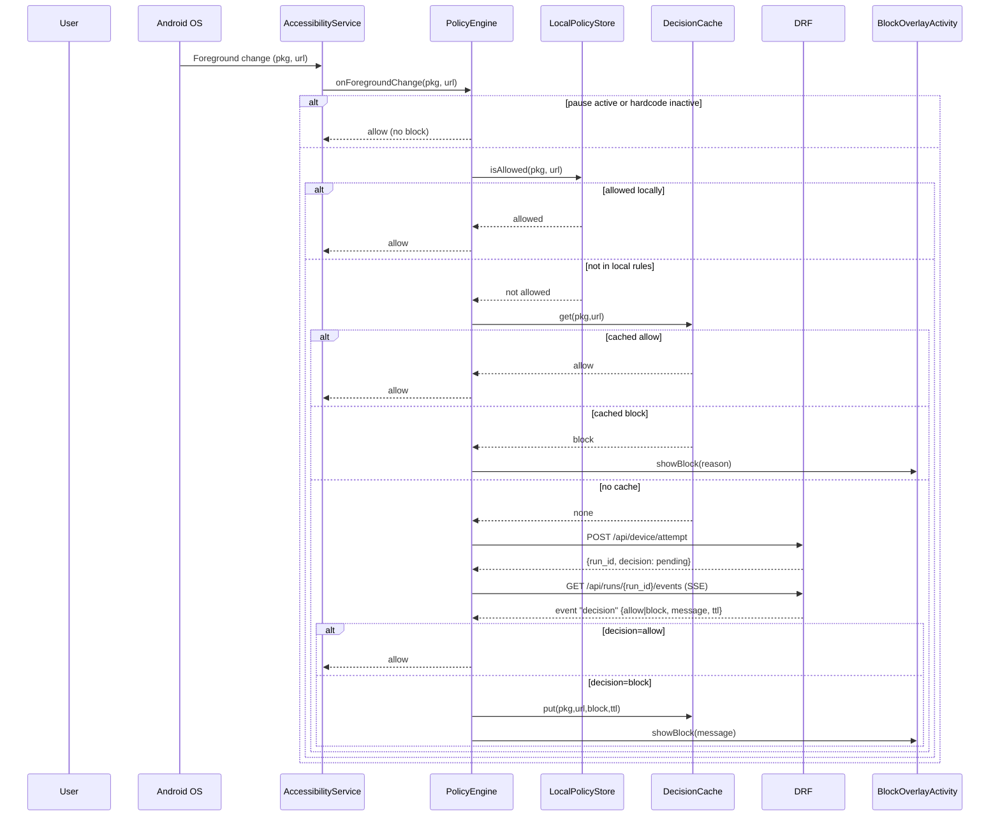
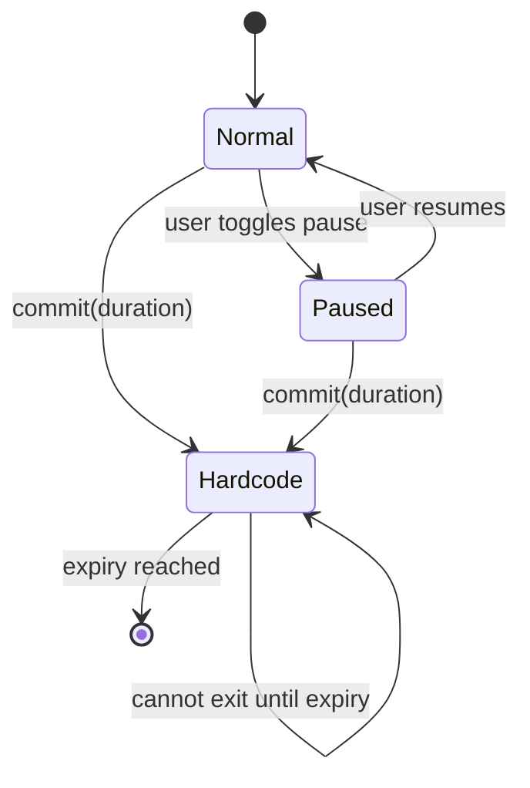
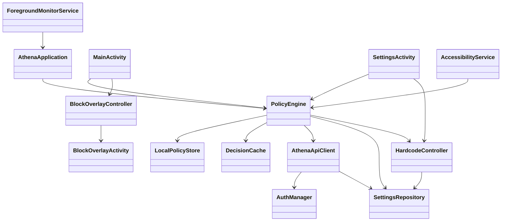

# Architecture Diagrams

This document illustrates several key flows and structures in the Athena Android app using [Mermaid](https://mermaid.js.org/) diagrams.  You can view these diagrams rendered in a Markdown viewer that supports Mermaid (e.g. GitHub, VS Code).

## App/URL Decision Flow

## PolicyEngine State Machine

## Android Components (Class Diagram)

These diagrams are adapted from the original proposal and modified to match the simplified implementation present in this repository.