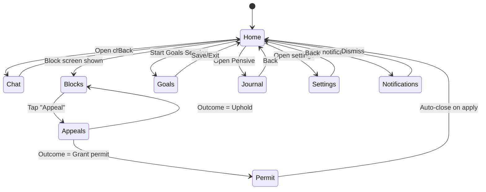
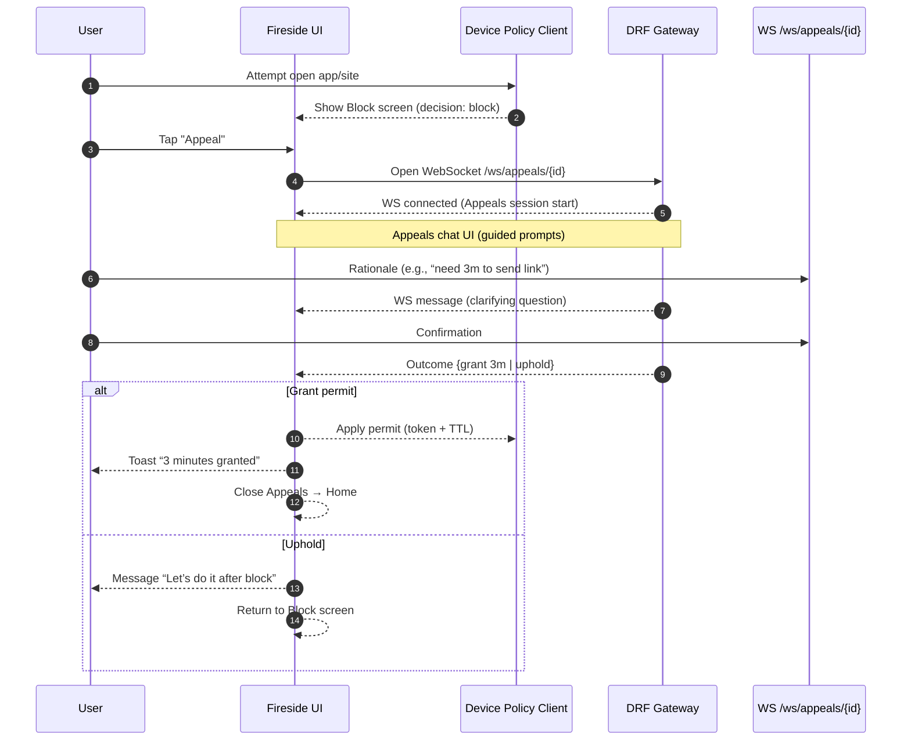
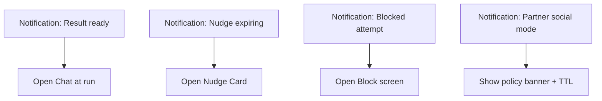

### 1) Fireside App — Top-level UI States



---

### 2) App/Site Block → Appeals (Full UI Sequence)



---

### 3) Nudge Flow (Micro-break Offer)

```mermaid
flowchart TD
    A[User opens borderline app/site] --> B[Decision: NUDGE]
    B --> C[Fireside shows Nudge Card<br/>“2 minutes, then back?”]
    C -->|Accept| D[Request permit (TTL=2m)]
    D --> E[Apply permit token on device]
    E --> F[Show countdown in UI]
    C -->|Decline| G[Show soft block message]
    F -->|TTL ends| H[Auto-close app/site + toast]
    H --> I[Return to previous focus view]
```

---

### 4) Goals Session (Owner → Schedule/Policies)

```mermaid
flowchart LR
    A[Open Goals Session] --> B[Edit Objectives<br/>and weekly targets]
    B --> C[Pick Habits / Constraints]
    C --> D[Preview Schedule Blocks<br/>(focus/social/sleep)]
    D --> E[Policy Mapping<br/>block → policy_id]
    E --> F[Strictness Prefs<br/>(range + tone)]
    F --> G[Save]
    G --> H[Toast “Schedule updated”]
    H --> I[Back to Home]
```

---

### 5) Fireside Home Composition (Wireframe-ish Map)

```mermaid
graph TD
    Home[Home Screen]
    Chat[Chat Thread<br/>(Athena persona)]
    Cards[Context Cards<br/>(Today schedule, Active policy, Nudges)]
    Buttons[Quick Actions<br/>(Appeal, Pause 5m, Journal, Goals)]
    Feed[Notifications Feed]

    Home --> Chat
    Home --> Cards
    Home --> Buttons
    Home --> Feed
```

---

### 6) Notification Tap Flows



---

#### UI Notes (implementation cues)

* **Block screen**: large title, reason tag (“Deep Focus”), two buttons: **Appeal** and **Back to work**.
* **Nudge card**: primary button = **Accept 2m**, secondary = **Not now**; show small countdown if accepted.
* **Appeals chat**: 3–4 message max, with a visible **“time left”** indicator; outcome banner at top.
* **Policy banner**: non-modal; shows current policy + TTL; tap reveals details.
